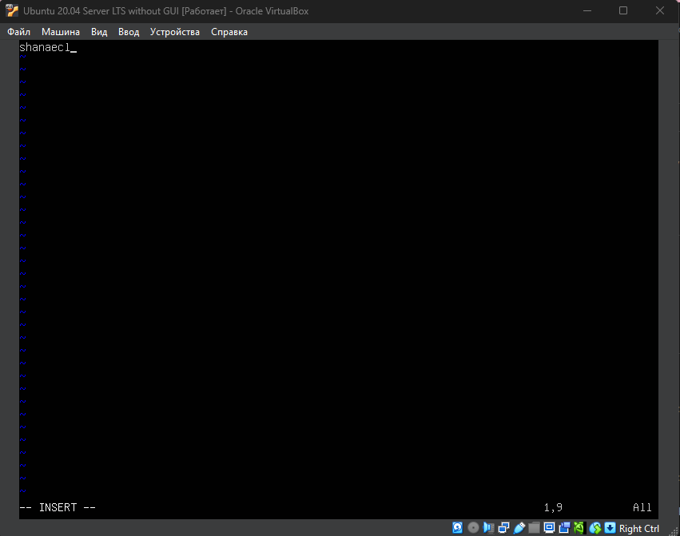
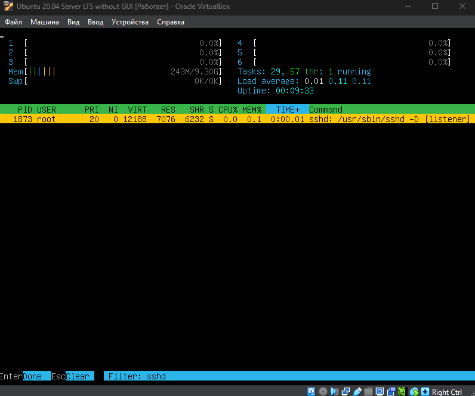
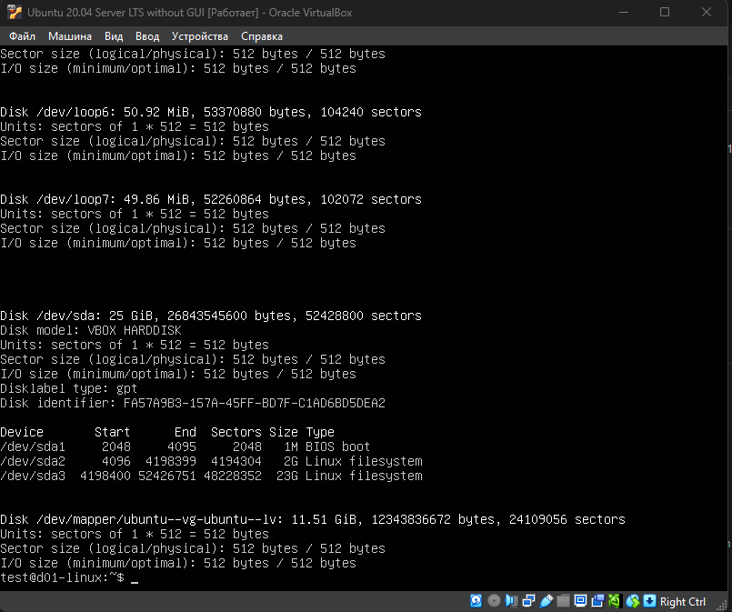

# D01_Linux Project Report

## Part 1. Installation of the OS

*   Скриншот вывода команды `cat /etc/issue`, подтверждающий установку Ubuntu 20.04 Server LTS.

    

## Part 2. Creating a user

*   Скриншот команды `sudo adduser test` для создания нового пользователя.

    

*   Скриншот вывода команды `cat /etc/passwd | grep test`, подтверждающий, что пользователь `test` был успешно добавлен в систему.

    

## Part 3. Setting up the OS network

*   Для выполнения этого задания были проделаны следующие шаги:
    1.  **Изменение имени машины:** Имя хоста было изменено на `tea-without-milk` с помощью команды `sudo hostnamectl set-hostname tea-without-milk`.
    2.  **Установка часового пояса:** Был установлен часовой пояс, соответствующий моему местоположению (`Europe/Moscow`), командой `sudo timedatectl set-timezone Europe/Moscow`.
    3.  **Вывод сетевых интерфейсов:** Имена интерфейсов были получены командой `ip a`. Интерфейс `lo` (loopback) - это виртуальный сетевой интерфейс с IP-адресом `127.0.0.1`, который используется для сетевого взаимодействия внутри самой машины, без выхода в реальную сеть. Он необходим для тестирования и работы многих сетевых приложений.
    4.  **Получение IP от DHCP:** Адрес был уже получен автоматически. **DHCP (Dynamic Host Configuration Protocol)** - это сетевой протокол, позволяющий устройствам автоматически получать IP-адрес и другие параметры (шлюз, DNS-серверы) от сервера (обычно роутера) при подключении к сети.
    5.  **Определение адресов шлюза:** Внутренний IP-адрес шлюза (`10.0.2.2`) был найден командой `ip route`. Внешний IP-адрес был определен с помощью `curl ifconfig.me`.
    6.  **Настройка статического IP:** Был отредактирован конфигурационный файл `/etc/netplan/00-installer-config.yaml` для установки статического IP-адреса `10.0.2.15`, шлюза `10.0.2.2` и публичных DNS-серверов `1.1.1.1` и `8.8.8.8`. Затем конфигурация была применена командой `sudo netplan apply`.
    7.  **Проверка после перезагрузки:** После команды `sudo reboot` было проверено, что новые статические настройки сети применились корректно.

*   Скриншот успешного выполнения команд `ping 1.1.1.1` и `ping ya.ru`, подтверждающий наличие доступа к сети и корректную работу DNS.

    

## Part 4. OS Update

*   Скриншот вывода команды `sudo apt upgrade` после обновления системы. Сообщение `0 upgraded, 0 newly installed, 0 to remove and 0 not upgraded` подтверждает, что в системе установлены все последние обновления.

    

## Part 5. Using the sudo command

*   **Предназначение команды `sudo`:** `sudo` (superuser do) - это утилита, которая позволяет делегированному пользователю выполнять команды с правами другого пользователя (по умолчанию - суперпользователя `root`). Ее основная цель - повышение безопасности системы. Вместо того чтобы постоянно работать под учетной записью `root` с неограниченными правами (что рискованно), администратор использует свою обычную учетную запись, а для выполнения административных задач точечно повышает привилегии с помощью `sudo`. Это также обеспечивает аудит действий, так как каждое использование `sudo` логируется.

*   Скриншот, демонстрирующий изменение имени хоста на `d01-linux` из-под пользователя `seb` с помощью `sudo`. Изменение видно по смене имени в приглашении командной строки.

    
    

## Part 6. Installing and configuring the time service

*   Скриншот вывода команды `date`, показывающий корректное текущее время для моего часового пояса.

    

*   Скриншот вывода команды `timedatectl show`, где видна строка `NTPSynchronized=yes`, подтверждающая, что автоматическая синхронизация времени по сети активна.

    

## Part 7. Installing and using text editors

### VIM
*   **Создание и сохранение файла:**
    *   Скриншот редактора с введенным никнеймом перед сохранением.

        
    *   Чтобы сохранить изменения и выйти, я нажал `Esc` для перехода в обычный режим, затем ввел команду `:wq` и нажал Enter.

*   **Редактирование без сохранения:**
    *   Скриншот редактора с измененным текстом.

        
    *   Чтобы выйти без сохранения, я нажал `Esc`, затем ввел команду `:q!` и нажал Enter.

*   **Поиск и замена:**
    *   Скриншот с результатом поиска слова (подсвечено).

        
    *   Скриншот с введенной внизу экрана командой для замены слова.

        

### NANO
*   **Создание и сохранение файла:**
    *   Скриншот редактора с введенным никнеймом.

        
    *   Чтобы сохранить и выйти, я нажал `Ctrl+O`, `Enter` для подтверждения имени файла, а затем `Ctrl+X`.

*   **Редактирование без сохранения:**
    *   Скриншот редактора с измененным текстом.

        
    *   Чтобы выйти без сохранения, я нажал `Ctrl+X` и на вопрос о сохранении ответил `N`.

*   **Поиск и замена:**
    *   Скриншот с результатом поиска слова.

        
    *   Скриншот с открытым диалогом замены слова.

        

### MCEDIT
*   **Создание и сохранение файла:**
    *   Скриншот редактора с введенным никнеймом.

        
    *   Чтобы сохранить и выйти, я нажал `F2` для сохранения, а затем `F10` для выхода.

*   **Редактирование без сохранения:**
    *   Скриншот редактора с измененным текстом.

        

    *   Чтобы выйти без сохранения, я нажал `F10` и в появившемся окне выбрал `No`.

*   **Поиск и замена:**
    *   Скриншот с окном поиска.

        
    *   Скриншот с открытым окном замены.

        
        

## Part 8. Installing and basic setup of the SSHD service

*   Для настройки службы SSHD были выполнены следующие шаги:
    1.  Установлен пакет `openssh-server` командой `sudo apt install openssh-server`.
    2.  Служба была добавлена в автозагрузку с помощью `sudo systemctl enable ssh`.
    3.  В конфигурационном файле `/etc/ssh/sshd_config` стандартный порт `22` был изменен на `2022`.
    4.  Служба была перезапущена для применения изменений командой `sudo systemctl restart ssh`.
    5.  После перезагрузки системы проверена работоспособность службы.

*   **Объяснение команды `ps -aux | grep sshd`**:
    *   `ps` - утилита для вывода информации о запущенных процессах.
    *   `-a` - показать процессы всех пользователей.
    *   `-u` - вывести в подробном, ориентированном на пользователя формате.
    *   `-x` - показать процессы, не привязанные к терминалу (фоновые службы).
    *   `|` - перенаправляет вывод `ps` на вход следующей команды.
    *   `grep sshd` - фильтрует поток данных, оставляя только строки, содержащие `sshd`.

*   Скриншот вывода `netstat -tan`, где видна строка, подтверждающая прослушивание порта 2022.

    

*   **Объяснение ключей `netstat -tan` и вывода**:
    *   `-t`: показать только TCP-соединения.
    *   `-a`: показать все сокеты, включая прослушиваемые (LISTEN).
    *   `-n`: показать числовые адреса и порты, не пытаясь преобразовать их в имена.
    *   **Колонки вывода**: `Proto` (протокол), `Recv-Q/Send-Q` (очереди приема/отправки), `Local Address` (локальный адрес и порт), `Foreign Address` (удаленный адрес и порт), `State` (состояние).
    *   **`0.0.0.0`**: Означает, что сервер принимает подключения на любом из доступных сетевых интерфейсов машины.

## Part 9. Installing and using the top, htop utilities

*   **Анализ вывода утилиты `top`**:
    *   **uptime**: `00:06:56`
    *   **number of authorised users**: `2`
    *   **average system load**: `0.00, 0.01, 0.05`
    *   **total number of processes**: `142`
    *   **cpu load (%)**: `0.0 us, 0.1 su, 0.0 ni, 99.9 id 0.0 wa 0.0 hi 0.0 si 0.0 st`
    *   **memory load (MiB)**: `9519.0 total, 8503.7 free, 242.7 used, 772.6 buff/cache`
    *   **swap memory (MiB)**: `0.0 total, 0.0 free, 0.0 used, 9014.4 avali Mem`
    *   **pid of the process with the highest memory usage**: `1153`
    *   **pid of the process taking the most CPU time**: `2455`

*   **Скриншоты утилиты `htop`**:
    *   Процессы отсортированы по `PID`.

        
    *   Процессы отсортированы по `PERCENT_CPU`.

        
    *   Процессы отсортированы по `PERCENT_MEM`.

        
    *   Процессы отсортированы по `TIME`.

        
    *   Список процессов отфильтрован по `sshd`.

        
    *   Найден процесс `syslog` (rsyslogd) с помощью поиска.

        
    *   В "шапку" `htop` добавлены `hostname`, `clock` и `uptime`.

        

## Part 10. Using the fdisk utility

*   **Информация о диске, полученная с помощью `fdisk -l`**:
    *   **Имя жесткого диска**: `/dev/sda`
    *   **Емкость**: `25 GiB`
    *   **Количество секторов**: `52428800`
    *   **Размер swap**: `0` (Swap-раздел на диске отсутствует, swap отключен).
        
        

## Part 11. Using the df utility

*   **Информация о корневом разделе (`/`) из вывода `df`**:
    *   **Размер раздела**: `11758760`
    *   **Использовано**: `3103116`
    *   **Свободно**: `8036536`
    *   **Процент использования**: `28%`
    *   **Единица измерения**: 1K-блоки (килобайтные блоки).

*   **Информация о корневом разделе (`/`) из вывода `df -Th`**:
    *   **Тип файловой системы**: `ext4`.
	*   **Размер раздела**: `12G`
    *   **Использовано**: `3.0G`
    *   **Свободно**: `7.7G`
    *   **Процент использования**: `28%`

## Part 12. Using the du utility

*   Скриншот вывода команд для определения размера папок `/home`, `/var`, `/var/log` в байтах (`du -sb`).

    

*   Скриншот вывода команд для определения размера тех же папок в человекочитаемом формате (`du -sh`).

    

*   Скриншот вывода команды `du -h /var/log/*`, показывающий размеры каждого элемента внутри папки `/var/log`.

    

## Part 13. Installing and using the ncdu utility

*   Скриншот утилиты `ncdu` с анализом папки `/home`.

    

*   Скриншот утилиты `ncdu` с анализом папки `/var`.

    

*   Скриншот утилиты `ncdu` с анализом папки `/var/log`.

    

## Part 14. Working with system logs

*   **Информация о последнем успешном входе в систему (из `/var/log/auth.log`)**:
    *   **Время**: `Feb 27 18:02:51`
    *   **Имя пользователя**: `shanaecl`
    *   **Метод входа**: `sshd`

*   Скриншот отсутствия системных логов (`/var/log/auth.log`) с сообщением о перезапуске службы `sshd`.

    

## Part 15. Using the CRON job scheduler

*   Скриншот вывода из системного лога, показывающий как минимум две строки о выполнении `CRON` задачи.

    

*   Скриншот вывода команды `crontab -l`, показывающий список текущих задач для пользователя.

    

*   Скриншот вывода команды `crontab -l` после удаления всех задач, подтверждающий, что планировщик пуст (`no crontab for...`).

    
